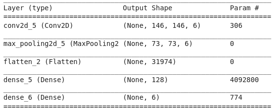
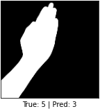

# Finger Digit Classification

* **Problem:** Attempt to identify how many fingers are raised in an image.

## Phase 1: Gathering Data

### Training Images:

### Test Images:

### Data Distribution and Base Accuracy:

## Phase 2: Build Overfitting Models
Attempt to build a model that overfits on the training set.

### Many Layer Model
Build a model with many layers and train it to score 100% on the training data.

### Output as Input Model
Build a model where training data includes the true output in the final channel.

### Results: Which model learned faster.

From the graph, it might seem that the Many Layer model overfit faster but the many layer model was trained with ImageGenerators and was exposed to more images for each epoch, which is why it converged earlier then the Output as Input model. In reality the Output as Input model actually finished training at a much master time than the Many Layer model.

## Phase 3: Split and Evaluate
Start training, and find the a good architecture:
* How to build an architecture: I started off with a basic architecture, layers are gradually added, once I start to notice that the accuracy start to decrease, I start working on the models with the best accuracy so far and start fine tuning it.

## Phase 4: Effects Of Augmentation
Find the optimal augmentation for the input data to ensure that the model gets the most out of learning. The result shows that augmentation is best around 10-20%, and too much augmentation will completely invalidate the data.

With the best model from Phase 3, train on different augmentation intensities:

## Phase 5: Effects Of Regularization
I experimented with different location of Dropout() and BatchNormalization(). 
### Best BatchNorm Location:

Accuracy: 91.33%

### Best Dropout Location:

Accuracy: 92.67%

## Phase 6: Using Pretrained Model
Use fine-tuning to train pretrained models to get the best performance. Check how it measures up again the model we've developed so far. For best results, I found that unfreezing the top layers of the convolutional base return the best accuracy score.

**Note:** My model performance on this graph is 90.67% because instead of importing previously obtained weights I retrained the "best" architecture from Phase 3 and this was the score.

## Common Mismatches:

